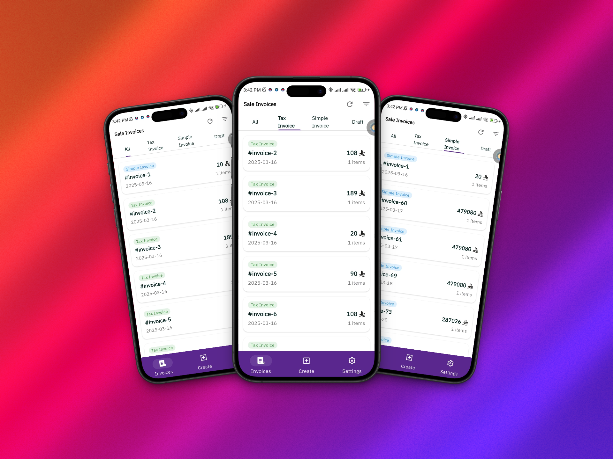
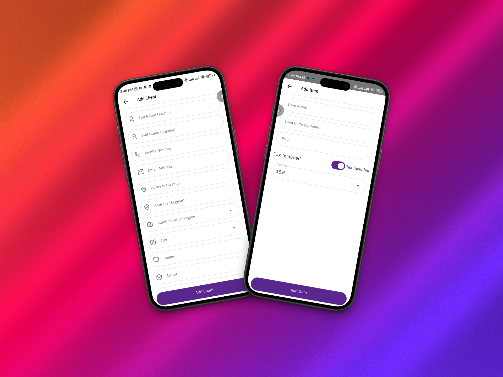

# 📌 E-Fatoora – E-Invoicing & Client Management  
*(Private, Pending Release)*  

## 🚀 Overview
E-Fatoora is a full-featured **electronic invoicing and client management system** built with Flutter.  
It enables businesses to manage clients, products, branches, and bank accounts, while ensuring **secure authentication** and efficient invoice workflows.  

---

## ✨ Features
- 🔐 **Secure Authentication & Authorization** (role-based).  
- 👥 Manage **Clients, Products, Branches, and Bank Accounts**.  
- 🧾 Full **Invoice Workflows**:  
  - Create & edit invoices.  
  - Handle drafts, taxes, and filtering.  
  - Automated actions: emailing & PDF download.  
- ⚡ **Scalable architecture** with clean integration to REST APIs.  
- 🎨 Responsive UI optimized for performance.  

---

## 📸 Screenshots

### 🔹 Splash & Authentication
<table>
  <tr>
    <td></td>
    <td></td>
  </tr>
  <tr>
    <td><b>Splash Screen</b></td>
    <td><b>Login</b></td>
  </tr>
</table>

 

### 🔹 Invoices Management
<table>
  <tr>
    <td></td>
    <td></td>
    <td></td>
  </tr>
  <tr>
    <td><b>All Invoices</b></td>
    <td><b>Create Invoice</b></td>
    <td><b>Invoice Details</b></td>
  </tr>
</table>

 

### 🔹 Adding & Management
<table>
  <tr>
    <td></td>
  </tr>
  <tr>
    <td><b>Add Item / Client</b></td>
  </tr>
</table>

---

## 🛠 Tech Stack
- **Flutter** (cross-platform mobile framework)  
- **REST APIs** (secure integration with backend)  
- **Clean Architecture** & local storage handling  

---

## 📂 Status
🚧 Project is currently in development and pending release on Google Play.  
